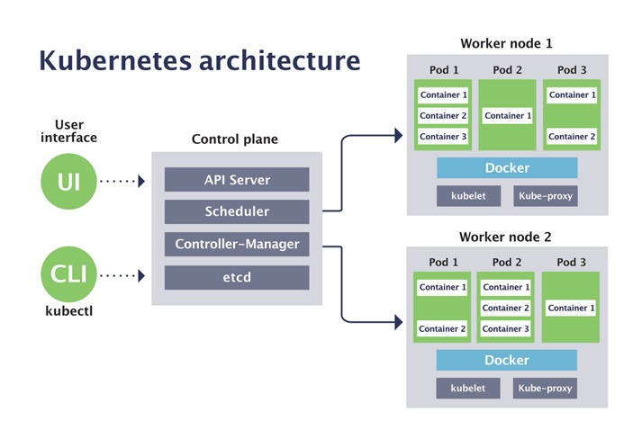

# A Reinforcement Learning-based Scheduler for Kubernetes

Kubernetes is a leading open source framework for container orchestration - the process of automating deployment and managing applications in a containerized and clustered environment. At its basic level, Kubernetes runs and coordinates container-based applications across a cluster of machines. It is designed to completely manage the life cycle of containerized applications and services using methods that provide predictability, scalability, and high availability.
A Kubernetes user provides the applications to be deployed in the form of pods - basic units of execution containing one or more tightly-coupled containers. These pods are then assigned to nodes, that represent actual computing resources such as physical or virtual servers. A collection of nodes forms a Kubernetes cluster, managed by the control plane. All nodes are heterogeneous by definition, that is, they may encapsulate resources of different capacities. Each node can contain and concurrently execute multiple pods. The following figure provides a simplified view of the architecture of Kubernetes.

Scheduling pods to nodes - that is, assigning each pod to a node on which it will be deployed - is a highly crucial, yet extremely difficult task. A suboptimal pod placement strategy could result in severe underutilization of cluster resources and unsatisfactory application performance. However, finding an optimal placement is a well-known NP-hard combinatorial problem (similar to bin packing) that cannot be solved under practical time and resource constraints. Therefore, the currently available implementation of Kubernetes scheduler, a component responsible for this task, resorts to simple heuristics that often provide results of poor quality.

The goal of this project is to design and implement an alternative scheduler for Kubernetes, utilizing recent advances in deep reinforcement learning to combine low running time with high quality of the produced placements. This RL-based scheduler will repeatedly attempt different pod placements in the cluster and learn the most potent scheduling decisions based on the resulting application performance and resource utilization. The scheduler will be fully compatible with any application currently relying on the default Kubernetes scheduler in terms of API and the supported parameters and constraints.

